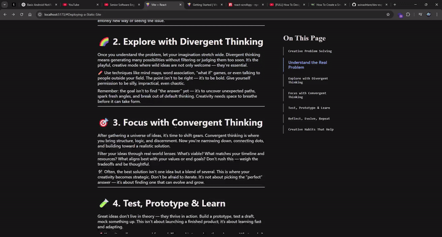

# 🧭 React ScrollSpy Docs Sidebar

This project implements a **React ScrollSpy-style sidebar**—just like the ones you see in modern documentation (e.g. Vite, Next.js, MDN). The sidebar highlights the section currently in view.



## 🛠️ Tech Stack

- **React**
- **react-scrollspy** – tracks the visible section and highlights the corresponding sidebar link
- **Vite** – lightning-fast dev environment
- **CSS** – custom dark mode layout

## 📁 Folder Structure

```
src/
├── App.jsx           # Main wrapper
├── Home.jsx          # Scrollable documentation content (main body)
├── OnThisPage.jsx    # Sidebar with anchor links (uses Scrollspy)
├── App.css           # Global styling (dark mode, scrollable layout)
└── index.css         # Base resets
```

## ✨ Features

- Smooth section-based navigation
- Sidebar auto-highlights current section with `.is-current` class
- Custom CSS for layout and styles
- Hidden scrollbars for clean look

## 🧪 How It Works

- Each `<section>` in `Home.jsx` has a unique `id`
- The `react-scrollspy` component in `OnThisPage.jsx` tracks which section is currently visible
- As you scroll, the link corresponding to the current section gets a highlight style

```jsx
<Scrollspy
  items={["Getting-Started", "Browser-Support", "Trying-Vite-Online"]}
  currentClassName="is-current"
>
  ...
</Scrollspy>
```

## ✅ To Run

```bash
npm install
npm run dev
```

Then open [http://localhost:5173](http://localhost:5173)

## 🧠 Notes for Future Me

- If `Scrollspy` isn't highlighting correctly, double-check that:
  - `id`s in `<section id="...">` exactly match the ones passed to `items` prop
  - The scrollable container (`.page-1`) has `overflow: scroll` and enough height
